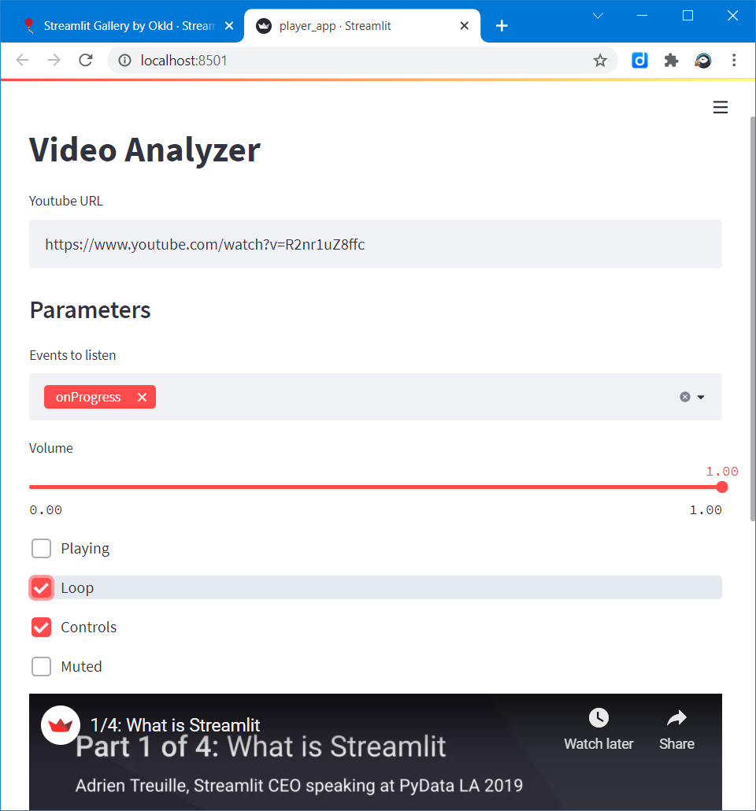

# 🎥 video-analyzer [](https://share.streamlit.io/slevin48/video-analyzer/main) 
Extract images from videos interactively 

*Continue the [video2speech2text app](https://github.com/slevin48/video2speech2text)*

## Streamlit Player



```python
import streamlit as st
from streamlit_player import st_player, _SUPPORTED_EVENTS

url = 'https://www.youtube.com/watch?v=R2nr1uZ8ffc'
url = st.text_input('Youtube URL',url)

st.subheader("Parameters")

options = {
    "events": st.multiselect("Events to listen", _SUPPORTED_EVENTS, ["onProgress"]),
    "progress_interval": 1000,
    "volume": st.slider("Volume", 0.0, 1.0, 1.0, .01),
    "playing": st.checkbox("Playing", False),
    "loop": st.checkbox("Loop", False),
    "controls": st.checkbox("Controls", True),
    "muted": st.checkbox("Muted", False),
}

event = st_player(url,**options)
st.write(event.data['played'])
```


## 🎬 Frame Selection

https://user-images.githubusercontent.com/12418115/143237301-6618a467-b7d8-40cb-8901-4c06ba911b8a.mp4

## 👀 Optical Character Recognition

Requires [Tesseract](https://tesseract-ocr.github.io/) to be installed locally

https://user-images.githubusercontent.com/12418115/143250106-2bac54d4-24a8-4ae5-9963-d9eb0adc030a.mp4


## Resources
- https://github.com/slevin48/video
- https://github.com/okld/streamlit-player
- https://github.com/CookPete/react-player
- https://github.com/okld/streamlit-gallery/blob/main/streamlit_gallery/components/react_player.py
- https://discuss.streamlit.io/t/streamlit-player/3169  
- https://discuss.streamlit.io/t/simple-example-of-persistence-and-waiting-for-input/2111